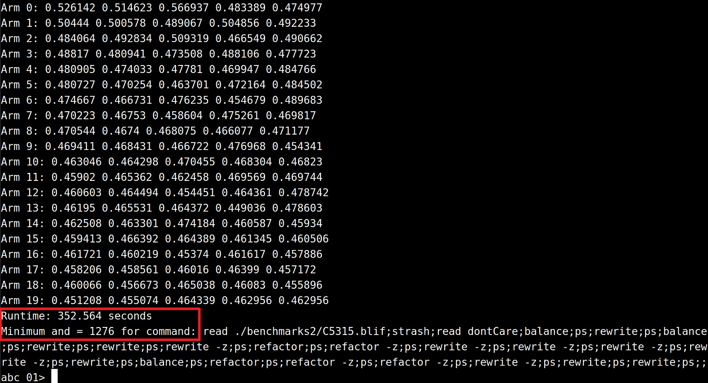

# CmabSyn
## [Logic Synthesis Compilation Autotuning through Combinatorial Multi-Armed Bandits](https://github.com/Noah-S-E/CmabSyn)

***
**Env dependencies:**
1. **abc 1.01**
2. **OpenMP 4.5**
3. **gcc 11.4.0**
4. **Yosys 0.39**


```
mkdir build
cd build
cmake ..
make
```


# Directory Structure
```
CmabSyn/
├── README.md                     # Documentation and an overview of the project.
├── test.png                      # Example showing the optimization process.
├── benchmarks/                   # Includes three benchmark datasets used for testing and optimization.
│   ├── arithmetic/               # Arithmetic circuits 
│   ├── VTR_benchmarks/           # VTR (Verilog-to-Routing) circuits 
│   └── SCE_benchmarks/           # SCE (superconducting electronic) circuits 
├── optimized_benchmarks/         # Contains optimized versions of the benchmark datasets for various objectives.
│   ├── 1.VTR_benchmarks_Logic_optimized/    # Logic-level optimizations performed on the VTR benchmarks.
│   ├── 2.SCE_benchmarks_Logic_optimied/     # Logic-level optimizations performed on the SCE benchmarks.
│   ├── 3.VTR_benchmarks_nangate45nm/        # VTR benchmarks optimized for Nangate 45nm technology mapping.
│   ├── 4.VTR_benchmarks_asap7nm/            # VTR benchmarks optimized for ASAP 7nm technology mapping.
│   ├── 5.VTR_benchmarks_FPGA/               # VTR benchmarks optimized specifically for FPGA mapping.
│   └── 6.arithmetic_benchmarks_FPGA/        # Arithmetic benchmarks optimized specifically for FPGA mapping.
└── src/                          # Source code for the project, including all logic synthesis and optimization implementations.

```


## Our Work


### **CmabSyn: An Optimization Framework for Logic Synthesis**

CmabSyn is a logic synthesis optimization framework based on the **Combinatorial Multi-Armed Bandit (CMAB)** algorithm. It tackles the challenges of exploring vast search spaces and avoiding local optima in circuit optimization by:

- **Dependency-Aware Optimization**: Introducing dependency relations through arm combinations and coordinating optimization operators with immediate and long-term reward strategies.
- **Learning with Linear Rewards**: Leveraging domain-specific knowledge to balance exploration and exploitation for decision-making.
- **Parallelization**: Significantly enhancing efficiency and reducing runtime.

Key results include up to **14.47% area improvement** and **1.38× runtime acceleration** for the ASAP 7nm standard cell library. CmabSyn demonstrates superior performance in **logic optimization**, **FPGA LUT mapping**, and **ASIC technology mapping**.

---
### Optimization Example
#### (Logic Optimization for C5315.blif)


